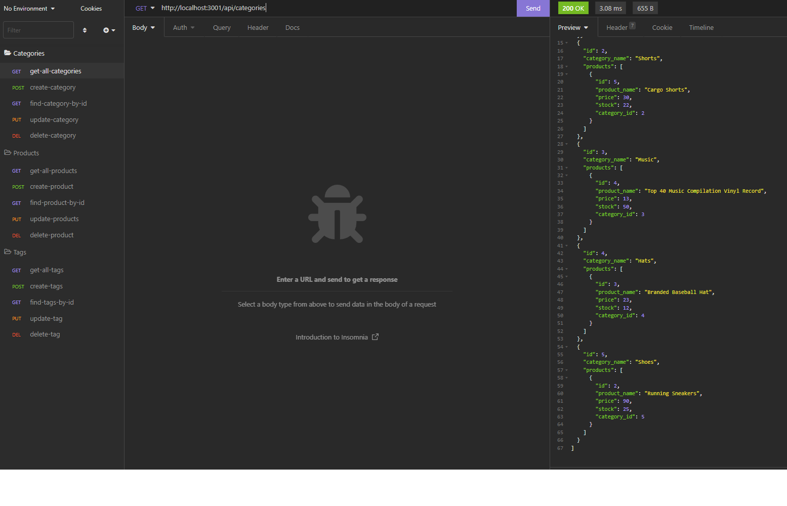

# orm-e-commerce

Object-Relational Mapping challenge for an E-commerce back end. If you want to demo yourself please clone or fork the repo and update the "your.env" file included. Rename this file to .env and enter your MySQL credentials in the empty quotation marks in the file.

## App details:

- A functional Express.js API
- When the user adds their MySQL username, and MySQL password to an environment variable file then they are able to connect to a database using Sequelize
- When the user enters schema and seed commands then a development database is created and is seeded with test data
- When the user enters the command to invoke the application their server is started and the Sequelize models are synced to the MySQL database
- When the user opens API GET routes in Insomnia for categories, products, or tags then the data for each of these routes is displayed in a formatted JSON
- When the user tests API POST, PUT, and DELETE routes in Insomnia then they are able to successfully create, update, and delete data in my database

### Demo Link:

Check out the demo [HERE](https://drive.google.com/file/d/1ryI61OjGGNhNFvK2zADN9oqkZYWZHxCH/view)

### Layout:

